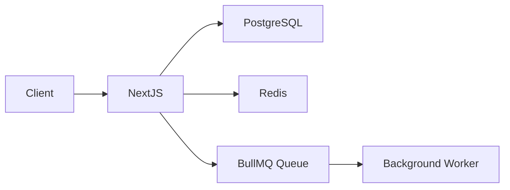

# Technology Stack — Selection & Standards

> This rule defines the **approved tech stack** for all projects. When starting a new project or proposing a new dependency, follow the decision criteria below.

---

## 🗂️ Quick Reference — Approved Stack

| Layer | Primary Choice | Alternative | Avoid |
|-------|---------------|-------------|-------|
| **Frontend — Landing/SEO** | Next.js 14+ (App Router) | — | CRA (deprecated) |
| **Frontend — Admin/Dashboard** | React + Vite (SPA) | — | Next.js (overkill for admin) |
| **Mobile — React Native** | Expo (managed) | React Native CLI (bare) | Flutter (unless team knows Dart) |
| **Mobile — UI Components** | NativeWind (Tailwind) | Tamagui, React Native Paper | Native Base (outdated) |
| **Mobile — Navigation** | React Navigation | Expo Router (Expo only) | — |
| **Mobile — State** | Zustand + TanStack Query | Redux Toolkit | MobX |
| **Mobile — Forms** | react-hook-form + zod | Formik + Yup | — |
| **Mobile — Storage** | MMKV | AsyncStorage, SecureStore | — |
| **Mobile — Animations** | react-native-reanimated | Animated API | — |
| **Mobile — Images** | expo-image / FastImage | Image (built-in) | — |
| **Mobile — Icons** | lucide-react-native | react-native-vector-icons | — |
| **Mobile — Push Notifications** | Firebase Cloud Messaging | OneSignal, expo-notifications | — |
| **Mobile — Analytics** | Firebase Analytics | Mixpanel, Amplitude | — |
| **Mobile — Crash Reporting** | Sentry | Firebase Crashlytics | — |
| **Mobile — Deep Linking** | React Navigation linking | expo-linking | — |
| **Mobile — OTA Updates** | EAS Update (Expo) | CodePush (RN CLI) | — |
| **Mobile — Testing** | Jest + RNTL | Detox (E2E) | — |
| **UI Components** | shadcn/ui + Radix UI | Chakra UI | MUI (too heavy) |
| **Styling** | Tailwind CSS | CSS Modules | Styled-components (runtime cost) |
| **State Management** | Zustand | Redux Toolkit | MobX, Recoil |
| **Data Fetching** | TanStack Query (React Query) | SWR | Axios alone |
| **Backend Framework** | Express.js + Node | Fastify | Hapi, Koa |
| **API Style** | REST (default) | tRPC (fullstack TS) | GraphQL (unless needed) |
| **Language** | TypeScript (always) | — | Plain JavaScript |
| **Database** | PostgreSQL | — | MySQL (prefer PG) |
| **ORM** | Prisma | Drizzle | Sequelize, TypeORM |
| **Cache** | Redis (ioredis) | Upstash Redis | Memcached |
| **Queue — Simple jobs** | BullMQ (Redis-backed) | — | — |
| **Queue — Enterprise/Microservices** | RabbitMQ | Kafka (high-throughput streams) | — |
| **Auth** | NextAuth.js (Next) / JWT+bcrypt (API) | Lucia Auth | Firebase Auth |
| **File Storage** | AWS S3 / Cloudflare R2 | Supabase Storage | Local disk (not scalable) |
| **Email** | Resend | Nodemailer + SMTP | SendGrid (expensive) |
| **Search** | PostgreSQL FTS (start here) | Meilisearch | Elasticsearch (unless needed) |
| **Monitoring** | Grafana + Prometheus | Datadog | — |
| **Logging** | Pino | Winston | console.log (production) |
| **Testing** | Vitest + Testing Library | Jest | Mocha |
| **E2E Testing** | Playwright | Cypress | Selenium |
| **CI/CD** | GitHub Actions | — | Jenkins (legacy) |
| **Containerization** | Docker + Docker Compose | — | — |
| **Deployment** | Vercel (frontend) + Railway/Fly.io (backend) | AWS | — |
| **API Docs** | Swagger / OpenAPI 3.0 | — | Postman collections only |

---

## 🖥️ Frontend — Chọn đúng framework

### Decision Table

| Tiêu chí | Next.js 14 (App Router) | React + Vite (SPA) |
|----------|------------------------|--------------------|
| **Mục đích** | Landing page, marketing, blog | Admin panel, dashboard, internal tool |
| **SEO** | ✅ SSR/SSG — Google index tốt | ❌ SPA — khó SEO |
| **Lưu trữ** | Vercel (tối ưu nhất) | Cloudflare Pages, Netlify, S3 |
| **Performance** | Server Components — ít JS gửi về client | Client-side rendering |
| **Auth** | NextAuth.js | JWT stored in cookie/localStorage |
| **API** | API Routes hoặc Server Actions | Gọi backend REST riêng biệt |
| **Build complexity** | Cao hơn | Đơn giản hơn |

> **Rule**: Một project thường có **cả hai** — Next.js cho public site + React cho admin.

---

### Next.js — Landing Page / SEO Project

```bash
npx create-next-app@latest my-landing \
  --typescript --tailwind --eslint --app --src-dir --import-alias "@/*"
```

**Tại sao Next.js cho landing page:**
- Server-Side Rendering (SSR) → Google crawl được nội dung
- Static Site Generation (SSG) → build thành HTML tĩnh, lưu CDN, siêu nhanh
- Image optimization tự động (`next/image`)
- `<head>` metadata API tích hợp sẵn
- Incremental Static Regeneration (ISR) → cập nhật nội dung không rebuild toàn bộ

```tsx
// app/layout.tsx — SEO metadata
export const metadata: Metadata = {
  title: { default: 'My App', template: '%s | My App' },
  description: 'Mô tả trang chính',
  openGraph: { type: 'website', locale: 'vi_VN', url: 'https://myapp.com' },
};
```

**Folder structure (App Router)**
```
src/app/
├── (marketing)/          # Public pages (SSG/SSR)
│   ├── page.tsx          # Homepage
│   ├── about/page.tsx
│   ├── blog/
│   │   ├── page.tsx      # Blog list (SSG)
│   │   └── [slug]/page.tsx  # Blog post (ISR)
│   └── pricing/page.tsx
├── (auth)/               # Auth pages
│   ├── login/page.tsx
│   └── register/page.tsx
├── api/v1/               # API Routes
└── layout.tsx
```

---

### React + Vite — Admin / Dashboard Project

```bash
npx create-vite@latest my-admin -- --template react-ts
cd my-admin && npm install
```

**Tại sao React SPA cho admin:**
- Admin panel không cần SEO (đăng nhập mới vào được)
- SPA build đơn giản, deploy lên S3/Cloudflare Pages/Nginx
- Trạng thái phức tạp (table, filter, form) dễ quản lý hơn
- Hot reload nhanh hơn trong development

**Folder structure (Vite SPA)**
```
src/
├── pages/               # Các trang (react-router)
│   ├── Dashboard.tsx
│   ├── Users/
│   │   ├── UserList.tsx
│   │   └── UserDetail.tsx
│   └── Settings.tsx
├── components/
│   ├── layout/          # Sidebar, Header, Layout
│   └── ui/              # Shared UI components
├── features/            # Feature-based modules
│   └── users/
│       ├── api.ts       # TanStack Query hooks
│       ├── store.ts     # Zustand slice
│       └── types.ts
├── lib/                 # axios instance, utils
└── main.tsx
```

**Key Rules for Admin:**
- Protected routes with `<AuthGuard>` component
- Role-based UI: `usePermission()` hook to show/hide features
- Automatic token refresh in axios interceptor

---

## 📱 Mobile — React Native + Expo

### Decision Table

| Criteria | Expo (Managed) | React Native CLI |
|----------|----------------|------------------|
| **Use Case** | Most apps (95%) | Complex native modules, custom builds |
| **Setup** | `npx create-expo-app` — 2 minutes | Manual Xcode/Android Studio config |
| **OTA Updates** | ✅ expo-updates built-in | ❌ Setup CodePush manually |
| **Build** | EAS Build (cloud) | Local build required |
| **Native Modules** | Expo SDK + config plugins | Full control |
| **Ejection** | Can eject when needed | Not applicable |

> **Rule**: Default to **Expo**. Only use bare RN CLI when you need native modules that Expo doesn't support.

---

### Expo — Project Setup

```bash
# Create new project with Expo Router
npx create-expo-app@latest my-app --template tabs

# Or blank template
npx create-expo-app@latest my-app --template blank-typescript
```

**Why Expo:**
- Zero config to start — runs immediately on iOS/Android
- Expo Router — file-based routing like Next.js
- EAS Build — cloud builds, no Mac required for iOS
- OTA updates — update JS bundle without App Store review
- Expo SDK — camera, notifications, auth, etc. out of the box

### Folder Structure (Expo Router)
```
my-app/
├── app/                        # File-based routing
│   ├── (tabs)/                 # Tab navigator group
│   │   ├── _layout.tsx         # Tab layout config
│   │   ├── index.tsx           # Home tab
│   │   ├── explore.tsx         # Explore tab
│   │   └── profile.tsx         # Profile tab
│   ├── (auth)/                 # Auth stack group
│   │   ├── _layout.tsx
│   │   ├── login.tsx
│   │   └── register.tsx
│   ├── (modals)/               # Modal screens
│   │   └── settings.tsx
│   ├── [id].tsx                # Dynamic route
│   ├── _layout.tsx             # Root layout
│   └── +not-found.tsx          # 404 screen
├── components/
│   ├── ui/                     # Shared UI components
│   └── features/               # Feature-specific components
├── lib/
│   ├── api.ts                  # API client (axios/fetch)
│   ├── auth.ts                 # Auth helpers
│   └── storage.ts              # AsyncStorage/SecureStore wrapper
├── stores/                     # Zustand stores
├── hooks/                      # Custom hooks
├── constants/                  # Colors, config
├── assets/                     # Images, fonts
├── app.json                    # Expo config
└── eas.json                    # EAS Build config
```

### UI Components — Tamagui (Recommended)

```bash
npx expo install tamagui @tamagui/config
```

**Why Tamagui:**
- Compile-time CSS extraction — excellent performance
- Universal (iOS, Android, Web) with same API
- Design tokens, themes, dark mode built-in
- API similar to styled-components

```tsx
// components/ui/Button.tsx
import { Button as TamaguiButton, styled } from 'tamagui';

export const Button = styled(TamaguiButton, {
  backgroundColor: '$primary',
  paddingHorizontal: '$4',
  paddingVertical: '$3',
  borderRadius: '$2',
  
  variants: {
    variant: {
      outline: {
        backgroundColor: 'transparent',
        borderWidth: 1,
        borderColor: '$primary',
      },
    },
  },
});
```

### Alternative: NativeWind (Tailwind for RN)

```bash
npx expo install nativewind tailwindcss
```

```tsx
// Use Tailwind classes
import { View, Text } from 'react-native';

export function Card() {
  return (
    <View className="bg-white rounded-lg p-4 shadow-md">
      <Text className="text-lg font-bold text-gray-900">Title</Text>
    </View>
  );
}
```

### Navigation — Expo Router

```tsx
// app/_layout.tsx — Root layout
import { Stack } from 'expo-router';

export default function RootLayout() {
  return (
    <Stack>
      <Stack.Screen name="(tabs)" options={{ headerShown: false }} />
      <Stack.Screen name="(auth)" options={{ headerShown: false }} />
      <Stack.Screen name="(modals)/settings" options={{ presentation: 'modal' }} />
    </Stack>
  );
}

// app/(tabs)/_layout.tsx — Tab layout
import { Tabs } from 'expo-router';
import { Home, User, Search } from 'lucide-react-native';

export default function TabLayout() {
  return (
    <Tabs screenOptions={{ tabBarActiveTintColor: '#007AFF' }}>
      <Tabs.Screen name="index" options={{ title: 'Home', tabBarIcon: ({ color }) => <Home color={color} /> }} />
      <Tabs.Screen name="explore" options={{ title: 'Explore', tabBarIcon: ({ color }) => <Search color={color} /> }} />
      <Tabs.Screen name="profile" options={{ title: 'Profile', tabBarIcon: ({ color }) => <User color={color} /> }} />
    </Tabs>
  );
}
```

### State Management — Zustand + TanStack Query

```tsx
// stores/auth-store.ts
import { create } from 'zustand';
import { persist, createJSONStorage } from 'zustand/middleware';
import AsyncStorage from '@react-native-async-storage/async-storage';

interface AuthState {
  token: string | null;
  user: User | null;
  setAuth: (token: string, user: User) => void;
  logout: () => void;
}

export const useAuthStore = create<AuthState>()(
  persist(
    (set) => ({
      token: null,
      user: null,
      setAuth: (token, user) => set({ token, user }),
      logout: () => set({ token: null, user: null }),
    }),
    {
      name: 'auth-storage',
      storage: createJSONStorage(() => AsyncStorage),
    }
  )
);

// hooks/useUser.ts — TanStack Query
import { useQuery } from '@tanstack/react-query';
import { api } from '@/lib/api';

export function useUser(userId: string) {
  return useQuery({
    queryKey: ['user', userId],
    queryFn: () => api.get(`/users/${userId}`).then((res) => res.data),
  });
}
```

### API Client Setup

```tsx
// lib/api.ts
import axios from 'axios';
import { useAuthStore } from '@/stores/auth-store';
import Constants from 'expo-constants';

const API_URL = Constants.expoConfig?.extra?.apiUrl || 'http://localhost:3000/api/v1';

export const api = axios.create({
  baseURL: API_URL,
  timeout: 10000,
});

api.interceptors.request.use((config) => {
  const token = useAuthStore.getState().token;
  if (token) {
    config.headers.Authorization = `Bearer ${token}`;
  }
  return config;
});

api.interceptors.response.use(
  (response) => response,
  async (error) => {
    if (error.response?.status === 401) {
      useAuthStore.getState().logout();
    }
    return Promise.reject(error);
  }
);
```

### Secure Storage (Tokens, Sensitive Data)

```tsx
// lib/storage.ts
import * as SecureStore from 'expo-secure-store';

export const secureStorage = {
  async getItem(key: string): Promise<string | null> {
    return SecureStore.getItemAsync(key);
  },
  async setItem(key: string, value: string): Promise<void> {
    await SecureStore.setItemAsync(key, value);
  },
  async removeItem(key: string): Promise<void> {
    await SecureStore.deleteItemAsync(key);
  },
};
```

### EAS Build & Submit

```bash
# Install EAS CLI
npm install -g eas-cli

# Login & configure
eas login
eas build:configure

# Build for stores
eas build --platform ios --profile production
eas build --platform android --profile production

# Submit to stores
eas submit --platform ios
eas submit --platform android
```

```json
// eas.json
{
  "cli": { "version": ">= 5.0.0" },
  "build": {
    "development": {
      "developmentClient": true,
      "distribution": "internal"
    },
    "preview": {
      "distribution": "internal"
    },
    "production": {}
  },
  "submit": {
    "production": {}
  }
}
```

### Environment Variables

```ts
// app.config.ts
import 'dotenv/config';

export default {
  expo: {
    name: 'My App',
    slug: 'my-app',
    extra: {
      apiUrl: process.env.API_URL,
      eas: { projectId: process.env.EAS_PROJECT_ID },
    },
  },
};

// Usage
import Constants from 'expo-constants';
const apiUrl = Constants.expoConfig?.extra?.apiUrl;
```

### Testing React Native

```bash
npx expo install jest jest-expo @testing-library/react-native
```

```tsx
// __tests__/Button.test.tsx
import { render, fireEvent } from '@testing-library/react-native';
import { Button } from '@/components/ui/Button';

describe('Button', () => {
  it('should call onPress when pressed', () => {
    const onPress = jest.fn();
    const { getByText } = render(<Button onPress={onPress}>Click me</Button>);
    
    fireEvent.press(getByText('Click me'));
    
    expect(onPress).toHaveBeenCalledTimes(1);
  });
});
```

### React Native Best Practices (Expo)

- **Performance**: Use `FlatList` instead of `ScrollView` for lists, `memo()` for heavy components
- **Images**: Use `expo-image` instead of `Image` — better caching
- **Animations**: Use `react-native-reanimated` for smooth 60fps animations
- **Forms**: Use `react-hook-form` + `zod` validation
- **Icons**: Use `lucide-react-native` or `@expo/vector-icons`
- **Deep linking**: Configure in `app.json` and Expo Router handles it automatically

---

## 📱 Mobile — React Native CLI (Bare Workflow)

> Use React Native CLI when you need full native control, custom native modules, or integration with existing native apps.

### Project Setup

```bash
# Create new project
npx @react-native-community/cli init MyApp --template react-native-template-typescript

# Or with specific RN version
npx @react-native-community/cli init MyApp --version 0.74.0
```

**When to use React Native CLI:**
- Custom native modules (Bluetooth, NFC, complex camera)
- Integration with existing iOS/Android codebase
- Specific native SDK requirements (banking, healthcare)
- Full control over Xcode/Android Studio configuration
- Brownfield apps (RN inside existing native app)

### Folder Structure (React Native CLI)
```
MyApp/
├── android/                    # Android native project
│   ├── app/
│   │   ├── build.gradle
│   │   └── src/main/
│   ├── build.gradle
│   └── settings.gradle
├── ios/                        # iOS native project
│   ├── MyApp/
│   │   ├── AppDelegate.mm
│   │   └── Info.plist
│   ├── MyApp.xcodeproj
│   └── Podfile
├── src/
│   ├── screens/                # Screen components
│   │   ├── HomeScreen.tsx
│   │   ├── ProfileScreen.tsx
│   │   └── auth/
│   │       ├── LoginScreen.tsx
│   │       └── RegisterScreen.tsx
│   ├── components/
│   │   ├── ui/                 # Shared UI components
│   │   └── features/           # Feature-specific components
│   ├── navigation/
│   │   ├── RootNavigator.tsx
│   │   ├── AppNavigator.tsx
│   │   └── AuthNavigator.tsx
│   ├── services/
│   │   ├── api.ts              # API client
│   │   └── storage.ts          # AsyncStorage wrapper
│   ├── stores/                 # Zustand stores
│   ├── hooks/                  # Custom hooks
│   ├── utils/                  # Utilities
│   ├── types/                  # TypeScript types
│   └── constants/              # Colors, config
├── __tests__/                  # Tests
├── App.tsx                     # Entry point
├── index.js                    # RN entry
├── babel.config.js
├── metro.config.js
├── tsconfig.json
└── package.json
```

### Navigation — React Navigation

```bash
npm install @react-navigation/native @react-navigation/native-stack @react-navigation/bottom-tabs
npm install react-native-screens react-native-safe-area-context
cd ios && pod install
```

```tsx
// src/navigation/RootNavigator.tsx
import { NavigationContainer } from '@react-navigation/native';
import { createNativeStackNavigator } from '@react-navigation/native-stack';
import { createBottomTabNavigator } from '@react-navigation/bottom-tabs';
import { HomeScreen, ProfileScreen, LoginScreen } from '@/screens';
import { useAuthStore } from '@/stores/auth-store';

const Stack = createNativeStackNavigator();
const Tab = createBottomTabNavigator();

function MainTabs() {
  return (
    <Tab.Navigator screenOptions={{ tabBarActiveTintColor: '#007AFF' }}>
      <Tab.Screen name="Home" component={HomeScreen} />
      <Tab.Screen name="Profile" component={ProfileScreen} />
    </Tab.Navigator>
  );
}

function AuthStack() {
  return (
    <Stack.Navigator screenOptions={{ headerShown: false }}>
      <Stack.Screen name="Login" component={LoginScreen} />
      <Stack.Screen name="Register" component={RegisterScreen} />
    </Stack.Navigator>
  );
}

export function RootNavigator() {
  const isAuthenticated = useAuthStore((s) => !!s.token);

  return (
    <NavigationContainer>
      <Stack.Navigator screenOptions={{ headerShown: false }}>
        {isAuthenticated ? (
          <Stack.Screen name="Main" component={MainTabs} />
        ) : (
          <Stack.Screen name="Auth" component={AuthStack} />
        )}
      </Stack.Navigator>
    </NavigationContainer>
  );
}
```

### UI Components — NativeWind (Recommended)

```bash
npm install nativewind tailwindcss
npx tailwindcss init
```

```js
// tailwind.config.js
module.exports = {
  content: ['./App.{js,ts,tsx}', './src/**/*.{js,ts,tsx}'],
  presets: [require('nativewind/preset')],
  theme: {
    extend: {
      colors: {
        primary: '#007AFF',
        secondary: '#5856D6',
      },
    },
  },
  plugins: [],
};
```

```tsx
// src/components/ui/Card.tsx
import { View, Text } from 'react-native';

export function Card({ title, children }: { title: string; children: React.ReactNode }) {
  return (
    <View className="bg-white rounded-xl p-4 shadow-md mx-4 my-2">
      <Text className="text-lg font-bold text-gray-900 mb-2">{title}</Text>
      {children}
    </View>
  );
}

// src/components/ui/Button.tsx
import { TouchableOpacity, Text } from 'react-native';

interface ButtonProps {
  title: string;
  onPress: () => void;
  variant?: 'primary' | 'outline';
}

export function Button({ title, onPress, variant = 'primary' }: ButtonProps) {
  const baseStyles = 'py-3 px-6 rounded-lg items-center';
  const variantStyles = {
    primary: 'bg-primary',
    outline: 'border border-primary bg-transparent',
  };
  const textStyles = {
    primary: 'text-white font-semibold',
    outline: 'text-primary font-semibold',
  };

  return (
    <TouchableOpacity className={`${baseStyles} ${variantStyles[variant]}`} onPress={onPress}>
      <Text className={textStyles[variant]}>{title}</Text>
    </TouchableOpacity>
  );
}
```

### API Client Setup (React Native CLI)

```tsx
// src/services/api.ts
import axios from 'axios';
import Config from 'react-native-config';
import { useAuthStore } from '@/stores/auth-store';

const API_URL = Config.API_URL || 'http://localhost:3000/api/v1';

export const api = axios.create({
  baseURL: API_URL,
  timeout: 10000,
});

api.interceptors.request.use((config) => {
  const token = useAuthStore.getState().token;
  if (token) {
    config.headers.Authorization = `Bearer ${token}`;
  }
  return config;
});

api.interceptors.response.use(
  (response) => response,
  async (error) => {
    if (error.response?.status === 401) {
      useAuthStore.getState().logout();
    }
    return Promise.reject(error);
  }
);
```

### Secure Storage (React Native CLI)

```bash
npm install react-native-keychain
cd ios && pod install
```

```tsx
// src/services/storage.ts
import * as Keychain from 'react-native-keychain';
import AsyncStorage from '@react-native-async-storage/async-storage';

export const secureStorage = {
  async setToken(token: string): Promise<void> {
    await Keychain.setGenericPassword('token', token);
  },
  async getToken(): Promise<string | null> {
    const credentials = await Keychain.getGenericPassword();
    return credentials ? credentials.password : null;
  },
  async removeToken(): Promise<void> {
    await Keychain.resetGenericPassword();
  },
};

export const storage = {
  async get<T>(key: string): Promise<T | null> {
    const value = await AsyncStorage.getItem(key);
    return value ? JSON.parse(value) : null;
  },
  async set<T>(key: string, value: T): Promise<void> {
    await AsyncStorage.setItem(key, JSON.stringify(value));
  },
  async remove(key: string): Promise<void> {
    await AsyncStorage.removeItem(key);
  },
};
```

### Environment Variables (React Native CLI)

```bash
npm install react-native-config
cd ios && pod install
```

```bash
# .env
API_URL=https://api.myapp.com
SENTRY_DSN=https://xxx@sentry.io/xxx

# .env.staging
API_URL=https://staging-api.myapp.com

# .env.production
API_URL=https://api.myapp.com
```

```tsx
// Usage
import Config from 'react-native-config';
console.log(Config.API_URL);
```

### Build & Release (React Native CLI)

```bash
# iOS — Debug
npx react-native run-ios

# iOS — Release build
cd ios && xcodebuild -workspace MyApp.xcworkspace -scheme MyApp -configuration Release

# Android — Debug
npx react-native run-android

# Android — Release APK
cd android && ./gradlew assembleRelease

# Android — Release AAB (for Play Store)
cd android && ./gradlew bundleRelease
```

### CodePush for OTA Updates

```bash
npm install react-native-code-push
# Follow setup: https://github.com/microsoft/react-native-code-push
```

```tsx
// App.tsx
import codePush from 'react-native-code-push';

function App() {
  return <RootNavigator />;
}

export default codePush({
  checkFrequency: codePush.CheckFrequency.ON_APP_RESUME,
  installMode: codePush.InstallMode.ON_NEXT_RESTART,
})(App);
```

### Testing (React Native CLI)

```bash
npm install --save-dev jest @testing-library/react-native @testing-library/jest-native
```

```tsx
// __tests__/Button.test.tsx
import { render, fireEvent } from '@testing-library/react-native';
import { Button } from '@/components/ui/Button';

describe('Button', () => {
  it('should call onPress when pressed', () => {
    const onPress = jest.fn();
    const { getByText } = render(<Button title="Click me" onPress={onPress} />);
    
    fireEvent.press(getByText('Click me'));
    
    expect(onPress).toHaveBeenCalledTimes(1);
  });

  it('should render outline variant correctly', () => {
    const { getByText } = render(
      <Button title="Outline" onPress={() => {}} variant="outline" />
    );
    expect(getByText('Outline')).toBeTruthy();
  });
});
```

### React Native CLI Best Practices

- **Performance**: Use `FlatList` with `getItemLayout` for fixed-height items, `memo()` for heavy components
- **Images**: Use `react-native-fast-image` for better caching and performance
- **Animations**: Use `react-native-reanimated` for 60fps animations on UI thread
- **Forms**: Use `react-hook-form` + `zod` for validation
- **Icons**: Use `react-native-vector-icons` or `lucide-react-native`
- **Deep linking**: Configure in `AndroidManifest.xml` and `Info.plist`
- **Splash screen**: Use `react-native-bootsplash` (recommended over `react-native-splash-screen`)
- **Debugging**: Use Flipper or React Native Debugger

### Expo vs React Native CLI — Quick Comparison

| Aspect | Expo | React Native CLI |
|--------|------|------------------|
| **Setup time** | 2 minutes | 30+ minutes |
| **Native modules** | Expo SDK + plugins | Full control |
| **Build** | Cloud (EAS) | Local (Xcode/Android Studio) |
| **OTA updates** | Built-in | CodePush |
| **App size** | Larger (~20MB+) | Smaller (optimized) |
| **Ejection** | Possible | N/A |
| **Best for** | Most apps, MVPs | Custom native, enterprise |

---

## 🗄️ Database — PostgreSQL + Prisma

### Why PostgreSQL
- ACID compliant, battle-tested
- Excellent JSON support (`jsonb`) — avoids needing MongoDB in most cases
- Full-text search built-in
- Row-level security for multi-tenant apps
- Best ORM support (Prisma, Drizzle)

### Prisma Setup
```bash
npm install prisma @prisma/client
npx prisma init --datasource-provider postgresql
```

### Prisma Schema Conventions
```prisma
// prisma/schema.prisma

model User {
  id        String   @id @default(cuid())   // ✅ cuid() for distributed systems
  email     String   @unique
  name      String?
  role      Role     @default(USER)
  createdAt DateTime @default(now())
  updatedAt DateTime @updatedAt
  deletedAt DateTime?                        // soft delete

  orders    Order[]

  @@map("users")                             // ✅ snake_case table name
  @@index([email])
}

enum Role {
  USER
  ADMIN
}
```

### Prisma Client — Singleton Pattern
```ts
// src/lib/db.ts
import { PrismaClient } from '@prisma/client';

const globalForPrisma = global as unknown as { prisma: PrismaClient };

export const db =
  globalForPrisma.prisma ||
  new PrismaClient({
    log: process.env.NODE_ENV === 'development' ? ['query', 'error'] : ['error'],
  });

if (process.env.NODE_ENV !== 'production') globalForPrisma.prisma = db;
```

### Migration Workflow
```bash
# Development: auto-migrate
npx prisma migrate dev --name add_user_role

# Production: apply pending migrations
npx prisma migrate deploy

# View DB in browser
npx prisma studio
```

### PostgreSQL Best Practices
- Use `cuid()` or `uuid()` for primary keys (not auto-increment integers for distributed systems)
- Always add `@@index` on foreign keys and frequently queried columns
- Use `jsonb` columns for flexible/schema-less data instead of adding MongoDB
- Enable `pg_trgm` extension for fuzzy search
- Set `statement_timeout` and `lock_timeout` for long queries

---

## ⚡ Cache — Redis + ioredis

### Why Redis
- Sub-millisecond latency
- Supports strings, hashes, lists, sets, sorted sets, streams
- Built-in TTL, pub/sub, Lua scripts
- Powers caching + queues (BullMQ) + rate limiting + sessions

### Redis Client Setup
```ts
// src/lib/redis.ts
import Redis from 'ioredis';

const globalForRedis = global as unknown as { redis: Redis };

export const redis =
  globalForRedis.redis ||
  new Redis(process.env.REDIS_URL!, {
    maxRetriesPerRequest: 3,
    enableReadyCheck: true,
    lazyConnect: true,
  });

if (process.env.NODE_ENV !== 'production') globalForRedis.redis = redis;
```

### Cache Helper
```ts
// src/lib/cache.ts
import { redis } from './redis';

export async function getOrSet<T>(
  key: string,
  fetcher: () => Promise<T>,
  ttlSeconds = 3600
): Promise<T> {
  const cached = await redis.get(key);
  if (cached) return JSON.parse(cached);

  const data = await fetcher();
  await redis.setex(key, ttlSeconds, JSON.stringify(data));
  return data;
}

export async function invalidate(pattern: string) {
  const keys = await redis.keys(pattern);
  if (keys.length) await redis.del(...keys);
}
```

### Redis Key Naming → See `naming-conventions.md`
```
myapp:v1:user:123:profile    (TTL: 1h)
myapp:v1:session:abc123      (TTL: 7d)
myapp:v1:rate_limit:ip:...   (TTL: 15m)
```

### Queue with BullMQ (Simple — default)
```ts
// src/queues/email-queue.ts
import { Queue, Worker } from 'bullmq';
import { redis } from '@/lib/redis';

export const emailQueue = new Queue('email', { connection: redis });
await emailQueue.add('send-welcome', { to: user.email, name: user.name });
```

---

## 📨 Queue — Chọn đúng loại

### Decision Table

| Tiêu chí | BullMQ | RabbitMQ | Kafka |
|----------|--------|----------|-------|
| **Khi dùng** | Jobs đơn giản, retry, schedule | Microservices, routing phức tạp | Event streaming, log, billions messages |
| **Throughput** | Trung bình | Cao | Cực cao (triệu msg/s) |
| **Persistence** | Redis TTL | Disk (durable) | Disk (log-based, immutable) |
| **Setup** | Redis có sẵn | Cài thêm RabbitMQ | Cài thêm Kafka + Zookeeper |
| **Retry** | ✅ Built-in | ✅ Dead Letter Queue | ✅ Consumer offset |
| **Ordering** | ❌ Không đảm bảo | ✅ Per-queue | ✅ Per-partition |
| **Replay** | ❌ | ❌ | ✅ Có thể replay |
| **Độ phức tạp** | Thấp | Trung bình | Cao |

> **Rule**: Mặc định dùng **BullMQ**. Chỉ dùng RabbitMQ khi microservices. Chỉ dùng Kafka khi cần stream lớn hoặc replay.

### BullMQ — Default (Redis-backed)
```ts
// Khi nào: email, notification, PDF, image resize, scheduled tasks
const emailQueue = new Queue('email', {
  connection: redis,
  defaultJobOptions: { attempts: 3, backoff: { type: 'exponential', delay: 2000 } },
});
```

### RabbitMQ — Microservices
```ts
// Khi nào: nhiều service cần nhận cùng 1 message (pub/sub), routing phức tạp
import amqplib from 'amqplib';

const conn = await amqplib.connect(process.env.RABBITMQ_URL!);
const channel = await conn.createChannel();

// Exchange-based routing
await channel.assertExchange('order.events', 'topic', { durable: true });
await channel.publish('order.events', 'order.placed', Buffer.from(JSON.stringify(payload)));

// Consumer
await channel.assertQueue('email-service.order.placed', { durable: true });
await channel.bindQueue('email-service.order.placed', 'order.events', 'order.placed');
channel.consume('email-service.order.placed', async (msg) => {
  if (!msg) return;
  const data = JSON.parse(msg.content.toString());
  await sendOrderEmail(data);
  channel.ack(msg);
});
```

### Kafka — High-throughput Streaming
```ts
// Khi nào: analytics events, audit logs, real-time feeds, > 100k msg/s
import { Kafka } from 'kafkajs';

const kafka = new Kafka({ brokers: [process.env.KAFKA_BROKER!] });

// Producer
const producer = kafka.producer();
await producer.send({
  topic: 'user-events',
  messages: [{ key: userId, value: JSON.stringify({ event: 'page_viewed', page: '/checkout' }) }],
});

// Consumer group
const consumer = kafka.consumer({ groupId: 'analytics-service' });
await consumer.subscribe({ topic: 'user-events', fromBeginning: false });
await consumer.run({
  eachMessage: async ({ message }) => {
    await analyticsService.track(JSON.parse(message.value!.toString()));
  },
});
```

### Queue Naming → See `naming-conventions.md`
```
BullMQ queue names: myapp.email.send
RabbitMQ exchange:  order.events  (type: topic)
RabbitMQ queue:     email-service.order.placed
Kafka topic:        user-events, order-events, payment-events
```


## 📄 Documentation

### API Documentation — OpenAPI / Swagger
```bash
npm install swagger-ui-express @asteasolutions/zod-to-openapi
```

- Every API endpoint MUST have OpenAPI annotations
- Auto-generate from code (Zod schemas or JSDoc)
- Mount at `/api-docs`
- Keep `openapi.yaml` committed to repo

### Code Documentation
```ts
/**
 * Find a user by their email address.
 * @param email - The user's email (must be lowercase)
 * @returns The user object or null if not found
 * @throws {AppError} If database is unavailable
 */
async function findUserByEmail(email: string): Promise<User | null> {}
```

### README Template (mandatory for every service)
```markdown
# Service Name

## What it does (1-2 sentences)

## Tech Stack
- Runtime: Node.js 20 + TypeScript
- Framework: Next.js 14
- Database: PostgreSQL (Prisma)
- Cache: Redis

## Quick Start
\`\`\`bash
cp .env.example .env
npm install
npx prisma migrate dev
npm run dev
\`\`\`

## Environment Variables → see .env.example
## API Documentation → /api-docs
## Architecture → docs/architecture.md
```

### Architecture Diagrams (docs/architecture/)
- Use **Mermaid** for all diagrams (version-controlled, no external tools)
- Required diagrams: System context, Component diagram, Data flow, DB ERD



---

## ✅ Technology Decision Process

When **proposing a new library or technology**, evaluate against these criteria:

| Criterion | Questions to ask |
|-----------|-----------------|
| **Necessity** | Does an approved alternative already solve this? |
| **Maintenance** | Stars > 1k? Last commit < 6 months? |
| **Bundle size** | Check bundlephobia.com — is it worth the KB? |
| **TypeScript** | Does it have native TS types? |
| **License** | Is it MIT/Apache? (No GPL in commercial products) |
| **Security** | `npm audit` — zero high/critical vulnerabilities |
| **Community** | Active issues/discussions? Stack Overflow answers? |

### Decision Template
```markdown
## Technology Decision: [Library Name]

**Problem**: What problem does this solve?
**Alternative evaluated**: What from the approved stack was considered?
**Why chosen**: Specific reason this is better for the use case
**Risk**: Known downsides or migration cost
**Decision**: ✅ Adopt / ❌ Reject
```
